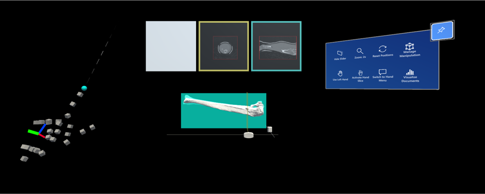

# [Mixed Reality Lab](http://www.vvz.ethz.ch/Vorlesungsverzeichnis/lerneinheit.view?lerneinheitId=139691&semkez=2020W&ansicht=KATALOGDATEN&lang=en) 2020, Course Project

- [Mixed Reality Lab 2020, Course Project](#mixed-reality-lab-2020-course-project)
  - [Team](#team)
  - [Project Description](#project-description)
  - [Features](#features)
    - [CT Scene](#ct-scene)
      - [**Manipulation**](#manipulation)
      - [**Plane Slicers**](#plane-slicers)
      - [**Hand Slicer**](#hand-slicer)
      - [**Hand or Near Menu**](#hand-or-near-menu)
      - [**Right-Left Hand**](#right-left-hand)
      - [**Document Viewer**](#document-viewer)
      - [**Change Scene**](#change-scene)
    - [Screw Manipulation Scene](#screw-manipulation-scene)
      - [**Hide Bone**](#hide-bone)
      - [**Focus on Plates**](#focus-on-plates)
      - [**Screw Resize**](#screw-resize)
      - [**Screw Rotate**](#screw-rotate)
      - [**Screw Reset**](#screw-reset)
      - [**Screw Delete**](#screw-delete)
      - [**New Screw with Hand**](#new-screw-with-hand)
      - [**New Screw with Hand**](#new-screw-with-hand-1)
      - [**Screw Length**](#screw-length)
  - [Logo](#logo)
  - [CT-Scans](#ct-scans)
  - [Importing Document in Slate](#importing-document-in-slate)
  - [Building and Deploying the project](#building-and-deploying-the-project)

## Team 
- **Dominik Alberto** ([@doalberto](https://github.com/doalberto)) doalbert@student.ethz.ch
- **Daniele Chiappalupi** ([@daniCh8](https://github.com/daniCh8)) dchiappal@student.ethz.ch
- **Jorel Elmiger** ([@elmigerj](https://github.com/elmigerj)) elmigerj@student.ethz.ch
- **Elena Iannucci** ([@eleiannu](https://github.com/eleiannu)) eiannucci@student.ethz.ch
- **Hamza Javed** ([@hamzajaved05](https://github.com/hamzajaved05)) javedh@student.ethz.ch

## Project Description
The goal of this project is to create a HoloLens 2 application able to assist surgeons during complex fracture surgeries. In some critical cases, bones can be fractured into many separate pieces that need to be realigned and fixed with an artificial supportive structure. The position and orientation of the bone structures is usually not well visible during the surgery, and surgeons have to remember their position from the scan inspection prior to the surgery. The major task is hence to allow surgeons to reinspect the scan data during the surgery and better understand individual bone positions as needed. 

Using the HoloLens 2 to do so would be of great benefit, since the surgeon can't physically touch any object during the surgery, to not compromise the sterilization of the surgery room. 

## Features

The project we developed provides many features that can be used by the surgeon depending on the way he wants to use the application. 

Below is a list of the features that are available right now in the app. 

### CT Scene

We distinguish between *CT Scene* and *Screw Manipulation Scene*. This first scene allows the user to create and view slices of the bone in different ways.

#### **Manipulation**

We allow different ways of manipulating the object in the scene. The user can choose whether to move all the objects together locking the relative position within them, or to move just the bone group or the scans group. 

You can click on the GIF above to see the full demo-video.

#### **Plane Slicers**

The plane slicers can be used to visualize a section of the bone on the windows above it. The two sliders allow to create either a horizontal or a vertical slice of the bone. The colour of the borders of the windows matches the colour of the sliders' squares.

You can click on the GIF above to see the full demo-video.

#### **Hand Slicer**

One of the main feature of the application is to use the hand as a bone slicer. Putting the hand on top of the bone allows to create a section of it with more freedom than using the plane slicers. Moreover, we developed a plane-locking mechanism that allows the user to lock the plane at a given position. The mechanism works in the following way: keeping the thumb aligned with the other fingers will keep slicing the bone, and raising the thumb perpendicular to the other fingers will lock the plane position and only allow movement in the normal direction of the locked plane. 

The plane locking mechanism can also be activated using voice-commands. The keyphrase "Stop Tracking" will lock the plane, and the keyphrase "Track My Hand" will unlock it back. See [this video](./doc/video/plane-locking-voice.mp4) with volume for a demonstration.

You can click on the GIF above to see the full demo-video.

#### **Hand or Near Menu**

For controlling the scene, we provide the user with a menu that allows him to have much freedom inside the application. This menu exists in two form, the [near menu](https://microsoft.github.io/MixedRealityToolkit-Unity/Documentation/README_NearMenu.html) and the [hand menu](https://microsoft.github.io/MixedRealityToolkit-Unity/Documentation/README_HandMenu.html). Both the menu are synchronized in terms of button-states. The default menu is the near one, and the user can then decide which one to use pressing the *Switch to Hand Menu* button. Likewise, the user can toggle the near menu back pressing the *Switch to Near Menu* button inside the hand menu.

You can click on the GIF above to see the full demo-video.

#### **Right-Left Hand**

The hand slicer can be used either with the right hand or with the left hand. To allow a better precision when tracking the hand slicer, we separate the two cases. By default, the hand slicer uses the right hand. If the user wants to use the left hand, he should first press the relative button on the menu.

You can click on the GIF above to see the full demo-video.

#### **Document Viewer**

We provide the user of a document viewer to visualize pre-uploaded documents. This may be useful in a real-world scenario, giving to the surgeon the possibility of visualizing memos and notes about the operation. See the [Importing Document in Slate](#importing-document-in-slate) section to know how to learn documents into the project.

You can click on the GIF above to see the full demo-video.

#### **Change Scene**

To switch between the *CT Scene* and the *Screw Manipulation Scene*, we placed a button in the menus. The relative positions of each scene are kept between the switches.

You can click on the GIF above to see the full demo-video.

### Screw Manipulation Scene

In this scene, the user can see, fix and tweak the screws that should be placed during the fracture surgery.

#### **Hide Bone**

The first basic functionality of this scene is the possibility of hiding the bone to only view the screws and the plates.

You can click on the GIF above to see the full demo-video.

#### **Focus on Plates**

This functionality allows the user to change the viewing of the plates and the screws. The possible modalities are:
- View each plate and all the screws (default).
- View only the lateral plate and the lateral screws.
- View only the medial plate and the medial screws.
- View no plate and all the screws.

You can click on the GIF above to see the full demo-video.

#### **Screw Resize**

This screw manipulation functionality allows to resize a screw. The only parameter that can be manipulated of the screws is their length. The diameter can't be modified.

You can click on the GIF above to see the full demo-video.

#### **Screw Rotate**

This screw manipulation functionality allows to rotate or move a screw. The selected screw should be grabbed and moved or rotated with the conventional hand gestures.

You can click on the GIF above to see the full demo-video.

#### **Screw Reset**

This screw manipulation functionality allows to reset the default screws to their original position and orientation. The selected screw does not get reset. The deleted screws are re-inserted.

You can click on the GIF above to see the full demo-video.

#### **Screw Delete**

This screw manipulation functionality allows to delete the selected screw. The deletion can be reverted by pressing the reset button - if the screw was a default one. Otherwise, the deletion can't be reverted.

You can click on the GIF above to see the full demo-video.

#### **New Screw with Hand**

A new screw can be created with the orientation of the hand by pressing the corresponding button. Until the thumb is down, the new screw can be oriented with the right hand. Once the thumb is raised, the new screw will be created. After selecting the first end-point, the color of the bone will get transparent to see better if the new screw may collide with other screws or not.

You can click on the GIF above to see the full demo-video.

#### **New Screw with Hand**

A new screw can be created selecting the two end-points on the bone by pressing the corresponding button. After selecting the first end-point, the color of the bone will get transparent to see better if the new screw may collide with other screws or not.

You can click on the GIF above to see the full demo-video.

#### **Screw Length**

The length of the selected screw is always visualized above the bone. To measure the distance between two points of the bone, just create a new screw selecting these two points (the new created screw can then be deleted as shown above). 

You can click on the GIF above to see the full demo-video.

## Logo

The official logo of the application is given by CustomSurg. It is used both as app menu icon and splash screen. 

You can click on the GIF above to see the full demo-video.

## CT-Scans
The medical scans we are provided with are in DICOM format. The pipeline we followed to use those scans is the following:
- We used [3D Slicer](https://www.slicer.org/) to turn them from binary format to [`nrrd`](https://en.wikipedia.org/wiki/Nrrd) format. Inside **Slicer**, we imported the *DICOM* folder containing the files, and saved the data in `nrrd` extension.
- `nrrd` format is a very broad one. To ease our computations, we allow only a specific `nrrd` setting in our project. To convert any `nrrd` file to the required settings, we used [this python script](/Assets/CT/convert.py) from an older version of the project. Note that this script will override the existing `nrrd` file.
- Finally, we can use the processed file inside our project. To do so, since in **Unity** we only work with *Text Assets*, we need to rename the `nrrd` file to have a `bytes` extension (i.e. from `ct.nrrd` to `ct.bytes`). This file can be then provided to a script inside **Unity** to read it. Scripts able to do so can be found in [`Assets/CT/`](/Assets/CT/).

## Importing Document in Slate
Displaying PDFs using Unity and C# is not a trivial task. Our first solution to this problem has been to convert each page of the pdf into a picture, and then using each picture to create a material that will be displayed on the Slate. An example of this can be found in [`Assets/PDF-Viewer/`](/Assets/PDF-Viewer).

After creating a material per slide, these materials should be placed ordered inside the [`Pages`](/Assets/PDF-Viewer/Pages.cs) component of the ContentQuad inside the Slate hierarchy. The size parameter should be set accordingly. This will allow the view of any document inside the Slate.

## Building and Deploying the project
After successfully imported the CT-Scans as explained [above](#ct-scans), from Unity go to `File -> Build Settings`. In the window this window, select the following configurations:
- `Target Device`: `Any device`;
- `Architecture`: `x64`;
- `Build Type`: `D3D Project`;
- `Target SDK Version`: `Latest installed`;
- `Minimum Platform Version`: `10.0.10240.0`;
- `Visual Studio Version`: `Latest installed`;
- `Build and Run on`: `Local Machine`;
- `Build configuration`: `Release`;
- `Compression Method`: `Default`;
- And leave the rest of the options unchecked.

This will create a bunch of files in the selected build folder. Open the solution file `Surgery.sln` with Visual Studio. To deploy it, be sure to select `Release` as `Solution Configuration` and `ARM` as `Solution Platform`. Before clicking play, go to `Project -> Surgery Properties -> Debugging` and insert the HoloLens' IP under `Machine Name`. Be also sure that both the computer and the HoloLens are connected to the same network. Finally, select `Remote Machine` and press play. This will deploy the application to the HoloLens.