# Changing Patient through Unity

<!-- TOC -->

-   [Changing Patient through Unity](#changing-patient-through-unity)
    -   [Requirements](#requirements)
        -   [Unity Hub](#unity-hub)
        -   [Unity v2019.4.26f1](#unity-v2019426f1)
        -   [Visual Studio](#visual-studio)
        -   [Project Download](#project-download)
    -   [Getting Started](#getting-started)
        -   [Unity Account](#unity-account)
        -   [Unity Hub License](#unity-hub-license)
        -   [Unity Location](#unity-location)
        -   [Project Location](#project-location)
    -   [Change Patient](#change-patient)
        -   [Open the Project](#open-the-project)
        -   [Project Setup](#project-setup)
        -   [New Patient Import](#new-patient-import)
        -   [New Patient Setup](#new-patient-setup)
            -   [PatientsController Attributes](#patientscontroller-attributes)
            -   [BoneManipulation Attributes](#bonemanipulation-attributes)
            -   [ScrewObjManipulation Attributes](#screwobjmanipulation-attributes)
            -   [Save the scene](#save-the-scene)
    -   [Build and Deploy](#build-and-deploy)
        -   [Unity Build](#unity-build)
        -   [Visual Studio Package Creation](#visual-studio-package-creation)
        -   [Find the App Packages](#find-the-app-packages)
    -   [Deploying to the HoloLens](#deploying-to-the-hololens)
        -   [Connecting via WiFi](#connecting-via-wifi)
        -   [Installing the App](#installing-the-app)

<!-- /TOC -->

## Requirements

### Unity Hub

[Download here](https://unity3d.com/get-unity/download). The Unity Hub is a management tool that you can use to manage all of your Unity Projects and installations.

### Unity v2019.4.26f1

[Download here](https://unity3d.com/unity/qa/lts-releases?version=2019.4). On the linked website, expand LTS Release 2019.4.26f1, and click on Download (Win) or Download (Mac) based on the OS you use. Use the downloaded file to install Unity, and remember the installation location because we will need it later.

When installing, Unity will ask what components to install. Select **Universal Windows Platform Build support** and **Windows Build support**.

### Visual Studio

[Download the Community version here](https://visualstudio.microsoft.com/). Visual Studio is a full-featured IDE to code, debug, test, and deploy to any platform. We will need it to build the application with the new patients loaded. On the installer, you have to tick the following boxes:

-   **.NET desktop development**
-   **Desktop development with C++**
-   **Universal Windows Platform development**
-   **Game development with Unity**

### Project Download

[Download the project folder here](https://github.com/daniCh8/mixed-reality-surgery-assistance-2020). Press on _Code_, select _Download ZIP_, and unzip the downloaded archive in your desired location. Keep in mind that the project's size is roughly 800 MB.

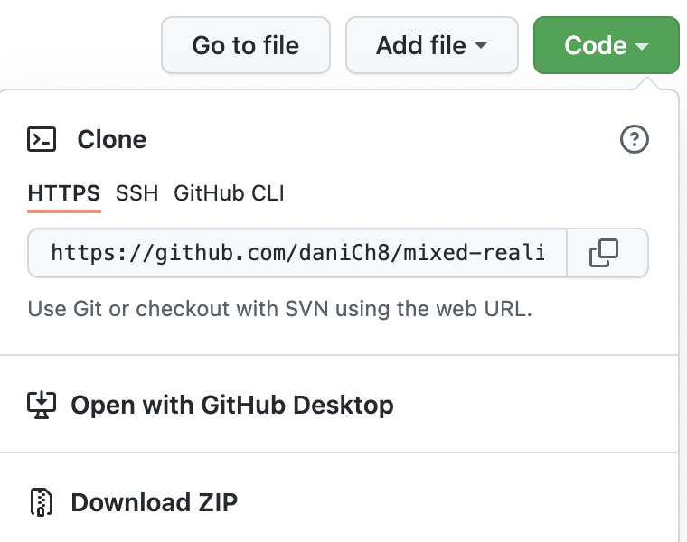

## Getting Started

### Unity Account

First, we will need to set up a Unity Account to use Unity and Unity Hub. Open Unity Hub and press the account button on the right.

Press on Sign in in the menu.

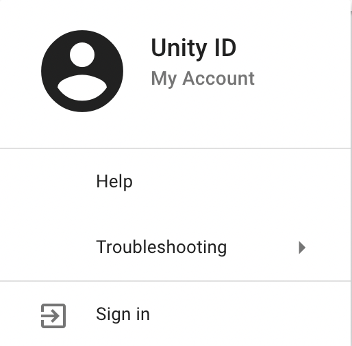

From here, create a new account if you don't have one, or sign in to your account.

### Unity Hub License

Now that we are logged in Unity Hub, we need to create a license to use Unity. Open Unity Hub and press the account button on the right. Click on Manage license from the menu.

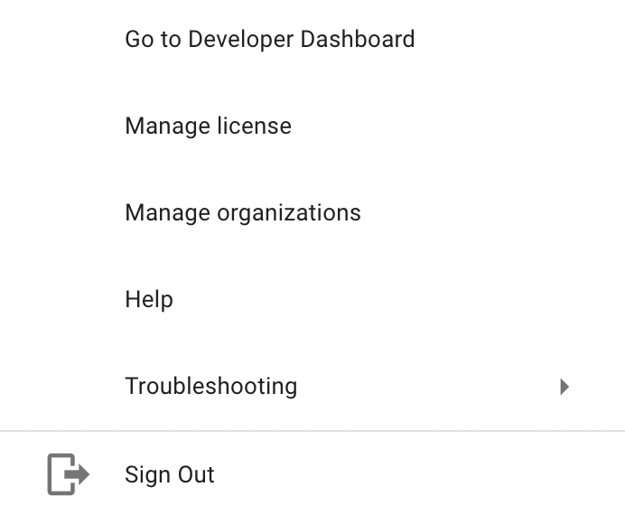

You can create a new license by pressing on _Activate new license_ and select _Unity Personal_ as a License Agreement.

### Unity Location

We need to wire the Unity Version we installed with Unity Hub. To do so, open Unity Hub and go to Installs through the menu on the left.

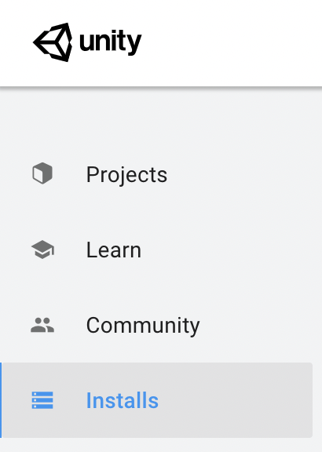

Press on the _Locate_ button, go to the Unity installation folder you used in the [Unity Installation](#unity-v2019426f1) and select the file `unity.exe` inside the Editor folder.

### Project Location

We need to locate the project folder in Unity Hub. To do so, open Unity Hub and go to Projects through the menu on the left.

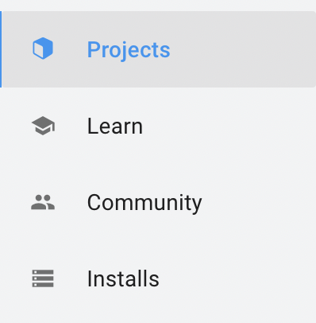

From here, press the _Add_ button and select the project folder you used in the [Project Download](#project-download).

## Change Patient

### Open the Project

In Unity Hub, open the project by pressing it in the project list. Before opening it, remember to select 2019.4.26f1 as Unity Version and Universal Windows Platform as Target Platform. Keep in mind that opening the project might take some time, especially the first time.

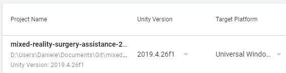

### Project Setup

If it is the first time you open the project, you will need to select the right scene to work on. To do so, you have to:

1. Navigate to Assets -> MyDemo in the project folders on the bottom of the screen.
2. Drag and drop SampleScene.unity in the hierarchy.
3. Remove the default scene.

You can see this process in the GIF below.

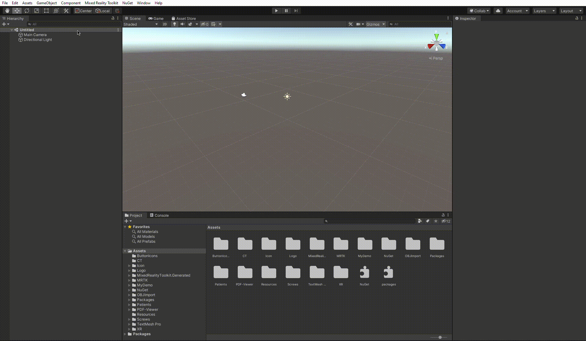

### New Patient Import

First, you need to import the patient data into the Unity project. The best way to do this is the following:

1. Create a new patient folder with all the necessary data on your file explorer. Naming and hierarchy of files in the new patient are not relevant.
2. Drag and drop the new patient folder into the patients' folder of the project.

This way, we will have the patient data correctly imported into the Unity project.

This process is shown in the GIF below.

### New Patient Setup

#### `PatientsController` Attributes

To set up the new patient, we will first need to change the attributes of the PatientsController. The app supports up to two patients right now. For this guide, let's use the PatientOne features to store the new patient. We have to perform the following steps:

1. Select the `PatientsController` in the hierarchy.
2. Put the new variables in the appropriate fields of the inspector. We will need to update the following attributes:
    - `Scans One`, where we will put the new patient's scan. **The scans should have the `.bytes` extension. Once you generated the `ct.nrrd` file, simply rename it to` ct.bytes`**
    - `Lat Screw One`, where we will put the new patient's lat screw positions (or None, if there are no lat screws for this patient).
    - `Med Screw One`, where we will put the new patient's med screw positions (or None, if there are no med screws for this patient).
    - `Dist Screw One`, where we will put the new patient's dist screw positions (or None, if there are no dist screws for this patient).
    - To assign `None` to values that a patient does not have, click on the pointer to the right of the attribute and select `None` from the dropdown menu. You can watch the GIF below to see it in action.
      

Below is a GIF showing the full process.

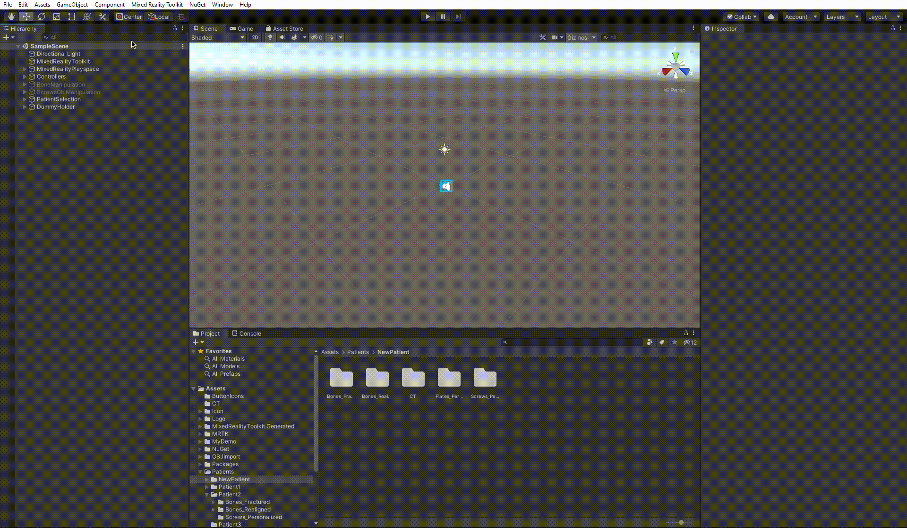

#### `BoneManipulation` Attributes

Now, we will need to update the patient references in the `BoneManipulation` scene. Let's see what steps we should follow:

1. Navigate to `BoneManipulation` -> `Bone_1` -> `BoneGroup` -> `Patient1` in the hierarchy.
2. Select all the objects under `Patient1` in the hierarchy, right-click on the selection, and press _Delete_.
3. Drag and drop all the fractured bone objs under `Patient1` in the hierarchy.
4. Select all the created objects, right-click on the selection, and press _Unpack Prefab Completely_.

The GIF below shows this process.

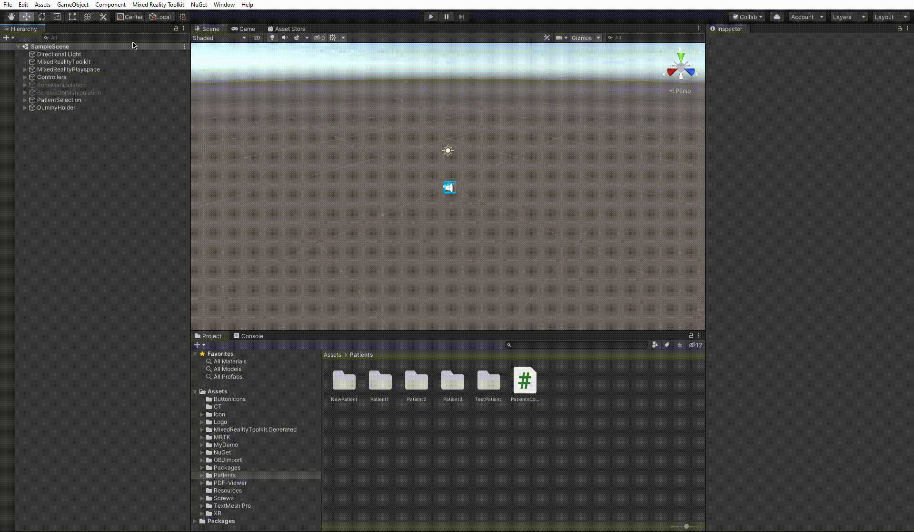

#### `ScrewObjManipulation` Attributes

Now, we will need to update the patient references in the `ScrewObjManipulation` scene. Let's see what steps we should follow:

1. Navigate to `ScrewObjManipulation` -> `BoneMix` -> `Patient1` in the hierarchy.
2. Select all the objects under `Patient1` -> `Plates` in the hierarchy, right-click on the selection, and press _Delete_.
3. Drag and drop all the plate objs under `Patient1` -> `Plates` in the hierarchy. You can skip this step if there are no plates for this patient.
4. Select all the created objects, right-click on the selection, and press _Unpack Prefab Completely_.
5. Select all the objects under `Patient1` -> `Bone` -> `MainBone` in the hierarchy, right-click on the selection and press _Delete_.
6. Select all the objects under `Patient1` -> `Bone` -> `FractureCollection` in the hierarchy, right-click on the selection and press _Delete_.
7. Drag and drop the main bone obj under `Patient1` -> `Bone` -> `MainBone` in the hierarchy.
8. Select the created bone object, right-click on the selection, and press _Unpack Prefab Completely_.
9. Drag and drop all the realigned fracture bone objs under `Patient1` -> `Bone` -> `FractureCollection` in the hierarchy.
10. Select all the created bone objects, right-click on the selection, and press _Unpack Prefab Completely_.

The GIF below shows this process.

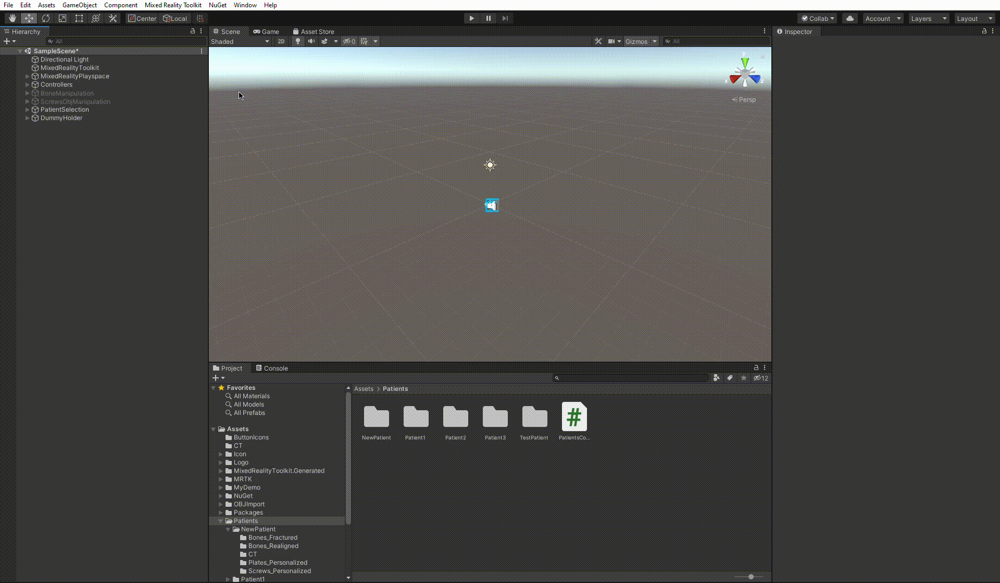

#### Save the scene

The new patient is now ready to be used! Let's not forget to save the scene to make sure that our changes will be used during the build. To do so, from Unity, go to File -> Save.

## Build and Deploy

### Unity Build

The first thing we need to do to create an app package is to build the Unity project. To do so, navigate to File -> Build Settings in Unity. Select Universal Windows Platform as a Platform (it should be selected by default). Pick the following configuration:

-   `Target Device`: `HoloLens`;
-   `Architecture`: `ARM64`;
-   `Build Type`: `D3D Project`;
-   `Target SDK Version`: `Latest installed`;
-   `Minimum Platform Version`: `10.0.10240.0`;
-   `Visual Studio Version`: `Latest installed`;
-   `Build and Run on`: `Local Machine`;
-   `Build configuration`: `Release`;
-   `Compression Method`: `Default`;
-   And leave the rest of the options unchecked.

Press on Build, and select a folder where to build the project. It would be best to create a new folder outside of the project folder and choose this new one as the build location. After selecting the folder, please wait for the build to finish (it will take some minutes).

The GIF below shows the building process in Unity.

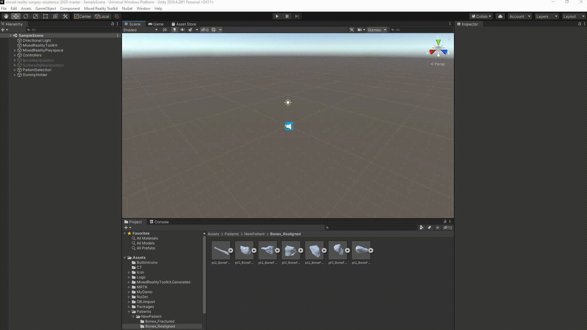

### Visual Studio Package Creation

Now that we built the Unity project, we need to create the App Package using Visual Studio. To do so, follow these steps:

1. Go to the build folder, and open the solution file (Surgery.sln). Keep in mind that Visual Studio could take some time to open and load the project.
2. On the Solution Explorer of Visual Studio (on the right of the screen), expand Surgery (Universal Windows), and double click on `App.h`. Wait until the loading is finished.
3. Click on Project -> Publish -> Create App Packages...
4. Select Sideloading as distribution method and press Next.
5. Select the current certificate as a signing method and press Next.
6. Be careful with the selection of packages. Check only ARM64 as Architecture, and select Release (ARM64) as Solution Configuration.
7. Press Create and wait for it to finish. This process takes some minutes.

Below is a GIF explaining the deployment process.

### Find the App Packages

When Visual Studio has finished the creation pipeline, we will look for the packages in the folder we used to build the project. The path to the app package in the build folder is AppPackages -> Surgery -> Surgery\_`VERSION`\_ARM64_Test

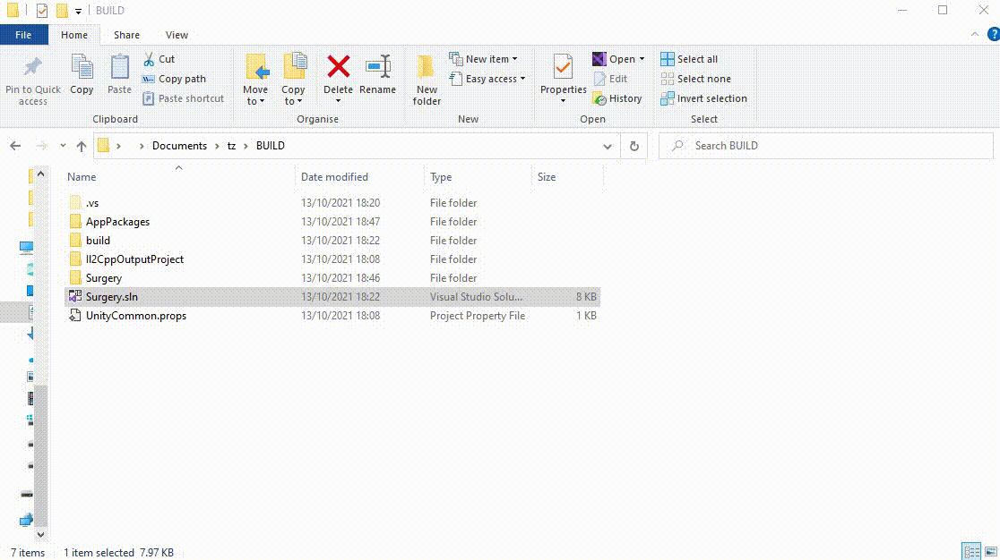

## Deploying to the HoloLens

Please note that on this section I will repurpose [this page of documentation from Microsoft](https://docs.microsoft.com/en-us/windows/mixed-reality/develop/platform-capabilities-and-apis/using-the-windows-device-portal#connecting-over-wi-fi).

### Connecting via WiFi

1. Connect your HoloLens to Wi-Fi.
2. Look up your device's IP address by either:
    - Going to Settings > Network & Internet > Wi-Fi > Advanced Options.
    - Going to Settings > Network & Internet and selecting Hardware properties.
    - Using the "What's my IP address?" voice command.
3. From a web browser on your PC, go to `https:/<YOUR_HOLOLENS_IP_ADDRESS> `The browser will display the following message: "_There's a problem with this website's security certificate_" because the certificate, which is issued to the Device Portal is a test certificate. You can ignore this certificate error for now and continue.
4. Enter your username and password to log in to the developer portal.

### Installing the App

1. In Windows Device Portal, navigate to the _Apps_ manager page.

2. Before installing the application, uninstall any previous version if present in the device. To do so, select the Surgery App on the dropdown menu under _Installed apps_ and press Remove.

3. Now let's install our package. In the _Deploy apps_ section, select _Local Storage_.

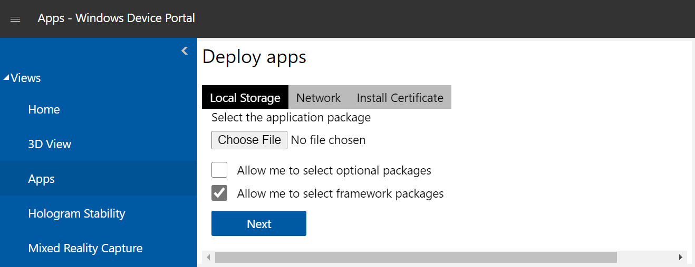

4. Under _Select the application package_, select _Choose File_ and browse to the app package we created using Visual Studio.
5. Select Install to start the installation.
6. Once the installation is complete, the Surgery app with the new patient is successfully installed in the HoloLens 2 device.

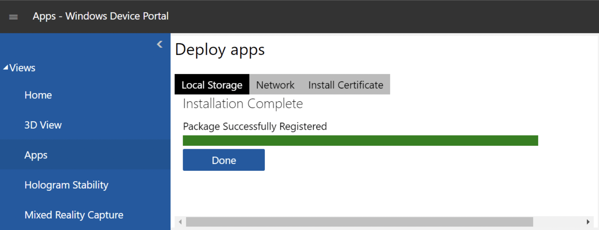
